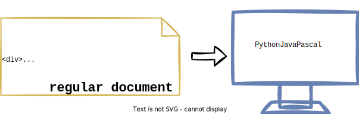

# d3*js* - **d**ata **d**riven **d**ocuments
Christian Pichler u. Maximilian Burger

<!-- 
**Christian**
Werte Lehrveranstalttungsleiter, liebe Kollegen,
wir haben im Laufe des Semesters das Thema d3js behandelt.
Was wir dabei gelernt haben, stellen wir euch gerne vor.
-->

---
<!--
**Christian**
Was sind data-driven-documents?
- Inhalt nicht durch markup generiert, sondern durch Daten
- Regeln werden festgelegt mittels js
- IdR durch DOM-Manipulation
 -->

## data driven documents
The content of d3-documents is not defined by markup-text. Instead you define rules how the interpreted data affects the final document.

<!-- paginate: true -->

---

<!--
**Christian**
Reguläres Dokument
- definiert durch Markup-Sprache
- Darstellungsmöglichkeiten begrenzt
-->

---

<!--
**Christian**
data-driven Dokument
- definiert durch Regeln und verarbeitenden Prozessor
- erzeugt finales Markup-Dokument, nicht nur Darstellung am Bildschirm   
-->

---
<!--
**Chrisitian**
besonders wichtig, warum werden neue 
's erzeugt
- select()Selects the first element that matches the specified selector.
- selectAll()Selects all elements (in document order) that match the specified selector.
- data()Binds the data to the items selected before.
- enter()The enter selection is used to create missing elements corresponding to the data.
- append()Creates a new html-element for each selected item.
- text()Sets the text content to given value of all selected elements
 -->

---

# Let's have look :telescope:

---

<!--
1. Example Max
2. Example Max
3. Example Christian
-->

- ## bar chart example

- ## cinema example

- ## tree example

---
<!--
**Max**
Steile Lernkurve - Vielzahl an Möglichkeiten
- krasse public Examples
- Aber nicht geeignet für Schnelles Charting/ Dashboarding
- Vergleich auf Example-Page Zeilen ChartJS
- Finale Meinung, Viele Möglichkeiten, Komplex in der Anwendung
-->

---

<!-- paginate: false -->

# Discussion
# :bangbang: :bomb: :boom:

